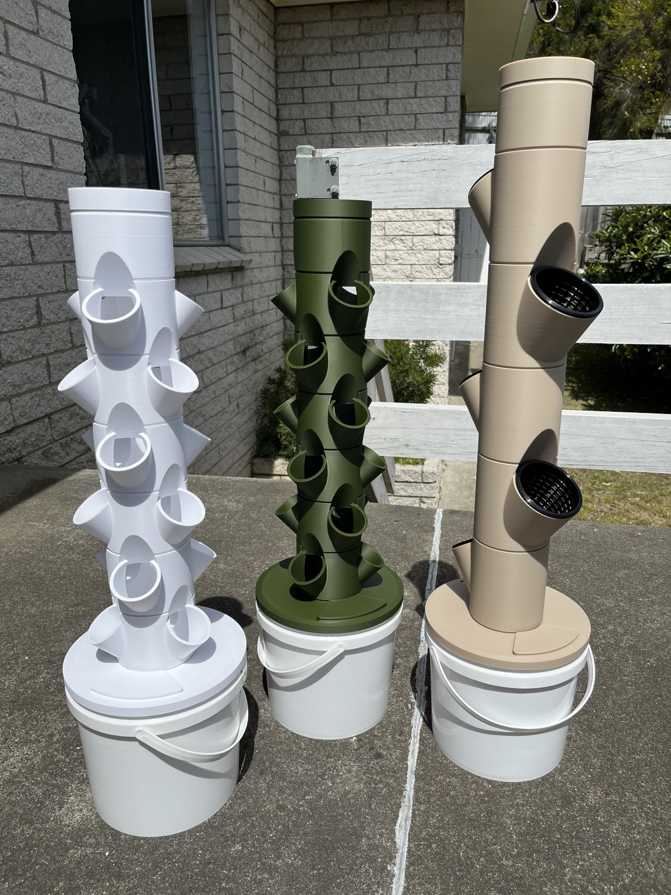

# Miniature, Modular, Indoor Grow Towers

## Intention

This is a project I've been working on for a little while with the intention, up until now, of starting a small business centered around hyper-local manufacturing of goods. The hope was to promote the idea of "garage factories," tiny print farms in people's spare space serving local communities with goods that would otherwise need to be sourced from large factories far away. Truth be told, though, I'm not a business person, and I don't think I want to move forward with it myself -- or at least not alone -- so I'm opening the project in the hope that others will see value in it and contribute their time and abilities to making it better than I ever could by myself.

My hope now is that folks will go about producing these grow towers for their own local communities, promoting both hyper-local manufacturing and home-grown produce.

## What's Here

These are small, modular, indoor, hydroponic grow towers made to sit in a living room or by a window. Included in the repo are:
* A variant with one 80mm net-pot receptacle per module: Fusion 360, STEP
* A variant with three 50mm net-pot receptacles per module: Fusion 360, STEP
* A mostly-complete (though certainly not perfectly written) user manual: PDF, (badly written) LaTeX; A4 format as well as A5 booklet format
* Wireframe diagrams of all parts and assembly steps: SVG
* 3MF files of all parts offering example printing parameters.

## What Needs to Be Done

A number of things need improvement:
* The manual needs an introduction, a sensible list of precautions, cleaning and maintenance recommendations, and general proofreading and refinement.
* The Fusion 360 files need to be cleaned up. I'm bad at keeping things organized while I work.
* **The current design only suits a common Australian brand of 5L bucket.** I'd love it if folks could contribute revised versions that suit buckets available in other parts of the world.
* We need a good open-source license that allows individuals to freely produce and sell these towers while excluding large manufacturers, corporations, and the wealthy. For now, I'm opting for the [Creative Commons Attribution-NonCommercial-ShareAlike 4.0 International license](https://creativecommons.org/licenses/by-nc-sa/4.0/).

## Printing Recommendations

The towers were designed to be printed by my Bambu Lab P1S printer, but they should be printable on any decent FDM printer, maybe with some tweaking of clearances.

**All parts are designed to be printed without supports.** Examples of recommended print orientation can be found in the example 3MF files. When printed with the recommended orientation and on a print surface such as textured PEI, the result should be a nice, textured finish on all upward-facing surfaces of the assembled tower. :)

For parts with little surface area contacting the print bed, eg planter modules, an inner brim can be used to promote bed adhesion.

Generally, I've been printing with:
* 0.28mm layer height
* 0.4mm nozzle, though 0.6mm or larger certainly isn't out of the question!
* 3 wall loops for planter modules; 6 wall loops for the bucket lid
* 3 top and bottom shell layers
* Rectilinear top and bottom surface pattern for the bucket lid; concentric top and rectilinear bottom surface pattern for the planter modules, bucket lid cap, bucket lid lock-ring, bucket lid cable glands, tower chimney, chimney lid
* **No supports**
* Gyroid infill, 15%
